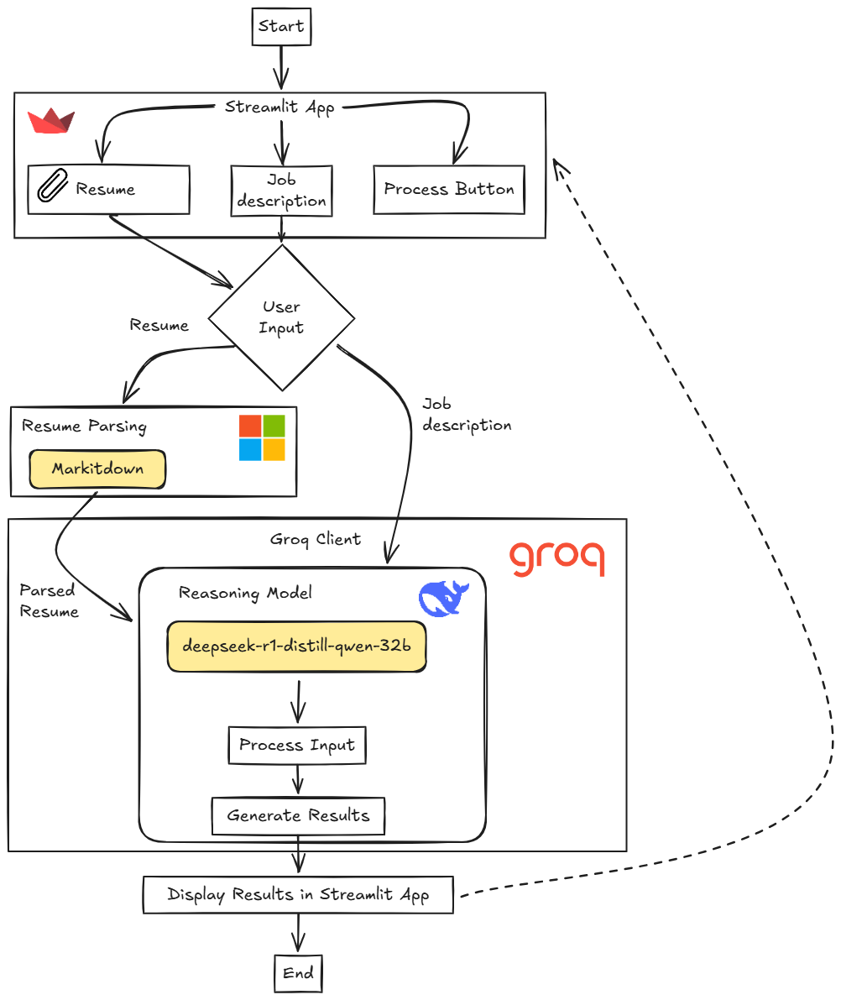

SWOT Analyzer Powered by DeepSeek R1
================================================================

Project Overview
----------------

This project leverages the advanced capabilities of **DeepSeek R1**, an AI model renowned for its exceptional reasoning performance, to deliver personalized **SWOT Analyses** (Strengths, Weaknesses, Opportunities, and Threats) by analyzing **CVs** and **Job Descriptions**.

[](https://www.youtube.com/watch?v=BaPc4MEcF3M))
### Ideal For

*   **Job Seekers**: Align your skills with market demands.
    
*   **Recruiters**: Precisely identify and bridge talent gaps.
    

### Key Features

*   **Advanced Reasoning**: Utilizes DeepSeek R1's state-of-the-art reasoning capabilities for in-depth analysis.
    
*   **Actionable Insights**: Provides strategic recommendations for growth and improvement.
    
*   **Efficiency & Precision**: Streamlines decision-making, saving time and reducing bias.

### Technical architecture

The system is built using **Streamlit** as the user interface, where users **upload a resume file( pdf or doc format)** and **manually input the job description**.  

Once the input is received, the system **parses the resume file** using **MarkItDown** (*a Python tool from Microsoft for converting files and office documents to Markdown*) for structured extraction.  

The parsed information, along with the job description, is then passed to the **deepseek-r1-distill-qwen-32b model** from groqcloud, which acts as the reasoning engine to analyze the content and generate a **SWOT analysis**. The model identifies:  

- **Strengths** based on skills and experience  
- **Weaknesses** in missing qualifications  
- **Opportunities** in aligning competencies with job trends  
- **Threats** in skill gaps or competition  

The results are then processed and displayed back in the **Streamlit app**, providing users with **actionable insights** to improve their resume alignment with job requirements.  

This system seamlessly integrates **resume parsing, job description analysis, and AI-driven reasoning** to offer a **comprehensive SWOT evaluation** for career enhancement.

How It Works
------------

1.  **Upload**: Submit your **CV** and **Job Description**.
    
2.  **Analyze**: Our advanced AI compares your skills and experience with job requirements.
    
3.  **Result**: A comprehensive **SWOT Analysis** pinpointing key strengths and areas for improvement.
    

Getting Started
---------------

### Prerequisites

*   Python 3.11 or above 🐍
*   Groq API for inference, which is currently available for free in its beta version with rate limits. You can obtain your API key here after creating an account: [Groq API](https://console.groq.com/keys).
    

# 💻 Local Deployment
### 1. Clone the Repository
```bash
git clone https://github.com/Mouez-Yazidi/SWOT-Analyzer-Powered-by-DeepSeek-R1.git
cd SWOT-Analyzer-Powered-by-DeepSeek-R1
```
### 2. Add Environment Variables

* Create a `.env` file and add the following variables according to the credentials you obtained from the required platforms:

    ```plaintext
    GROQ_KEY=
    ```
    
### 3. Install Dependencies
Navigate to the local directory and install the necessary dependencies:
```bash
pip install -r requirements.txt
```

### 4. Running the App Locally
To run the app locally, execute the following command:

```bash
streamlit run main.py --environment local
```
You should now be able to access the app at http://localhost:8501 🌐.

# ☁️ Streamlit Cloud Deployment
### 1. Prepare Your Repository
Ensure that your code is pushed to a GitHub repository 📂.

### 2. Link with Streamlit Cloud
* Visit Streamlit Cloud and sign in.
* Connect your GitHub repository 🔗.
* Choose your repository and branch.

### 3. Environment Variables
* Go to the "Advanced settings" section of your app.
* In the "Secrets" section, input any sensitive information, such as API keys or other credentials.
* Make sure to add this variables according to the credentials you obtained from the required platforms.
```csharp
GROQ_KEY=""
```
Streamlit Cloud will:
* Install dependencies from requirements.txt 📦

🎉 You’re all set! Your app will now be live on Streamlit Cloud!

# ✨ Show Your Support!
If you appreciate this project, I would be grateful if you could give it a star on GitHub. Your support motivates us to enhance and expand our work!

License
-------

This project is licensed under the MIT License.
